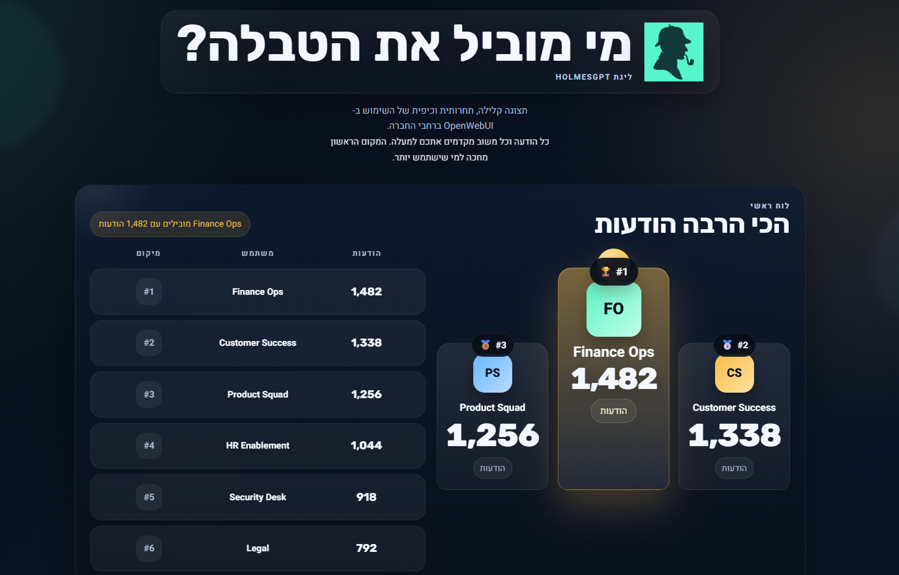

# OpenWebUI Leaderboard

Animated Hebrew-first leaderboard for OpenWebUI, packaged for Docker and Helm.



## Structure

- `web/` frontend
- `scripts/` database sync
- `chart/openwebui-leaderboard/` Helm chart
- `Dockerfile` production image

## Run Locally

```bash
python3 -m http.server 8000 --directory web
```

## Build

```bash
docker build -t openwebui-leaderboard:local .
```

## Deploy With Helm

Edit `chart/openwebui-leaderboard/values.yaml`:

- `app.openWebuiUrl`
- `database.type`
- `database.postgresql.*` or `database.sqlite.*`
- `ingress.*`

Then deploy:

```bash
helm upgrade --install openwebui-leaderboard ./chart/openwebui-leaderboard
```

The container syncs data from the OpenWebUI database into `leaderboard-data.json` automatically on startup and on a refresh interval.

## Airgapped Deployments

The frontend now works without any external browser requests by default:

- no Google Fonts calls
- no remote logo fetch

If you want a custom logo, set `BRAND_LOGO_URL` in Docker or `app.brandLogoUrl` in Helm to a reachable internal URL. Leaving it empty keeps the built-in local brand mark and avoids airgapped timeout issues.
